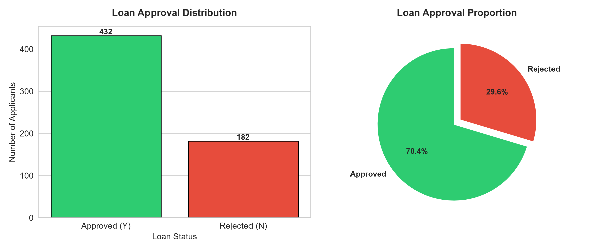
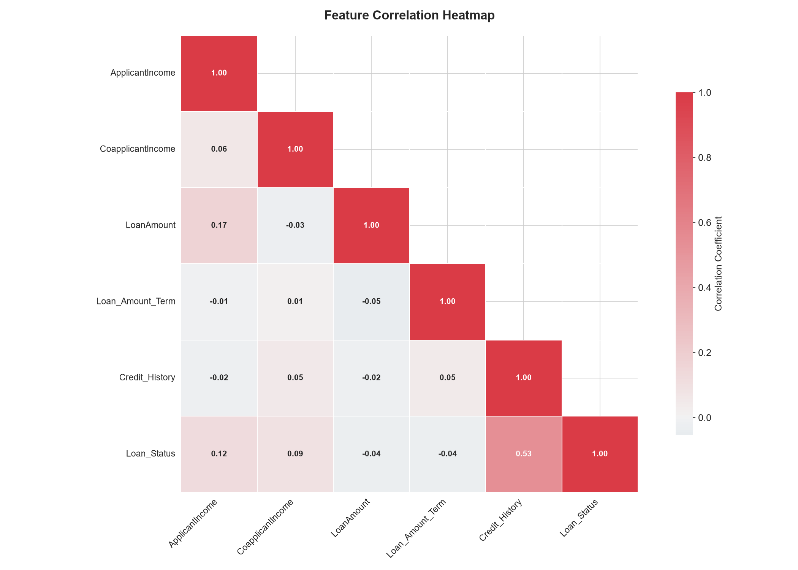
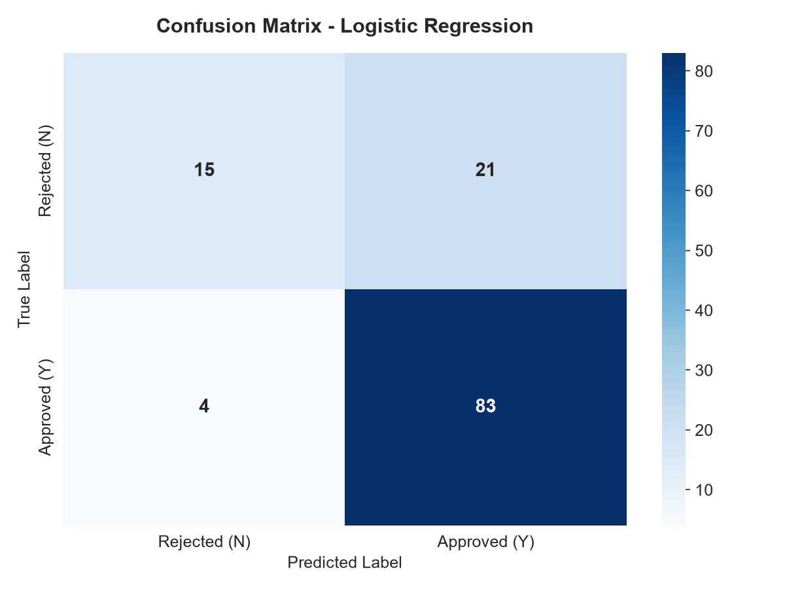
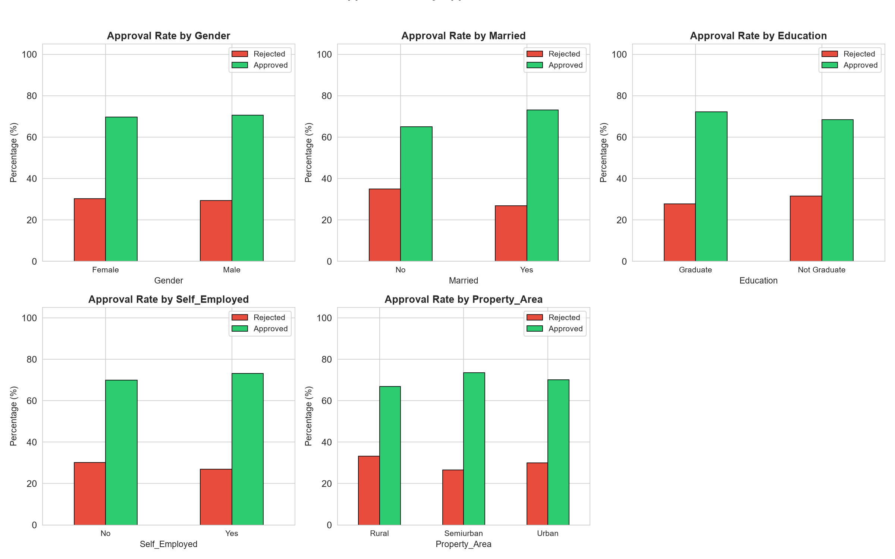

# Loan Approval Predictor Using Machine Learning


---

## Project Overview

Loan Approval Predictor is a **Machine Learning classification system** built to predict whether a loan application will be **approved** or **rejected** based on applicant information such as income, credit history, loan amount, employment status, and more.

This project was developed as part of an internship submission for **CodeTech IT Solutions**. It demonstrates a complete, production-quality Machine Learning pipeline from data exploration through model deployment, with clear documentation suitable for beginners and professionals alike.

---

## Business Problem

Banks and financial institutions receive thousands of loan applications daily. Manually reviewing each application is:

- Time-consuming and expensive
- Prone to human bias and inconsistency
- Difficult to scale during high-volume periods

An automated **Loan Approval Predictor** solves this by:

- Reducing manual effort and operational costs
- Providing consistent, data-driven decisions
- Enabling 24/7 application processing
- Minimizing financial risk through reliable predictions

This system acts as a **decision support tool** that helps loan officers make faster, more accurate approval decisions.

---

## Project Objectives

1. **Analyze** historical loan application data to identify patterns and key factors influencing loan approval.
2. **Build** multiple Machine Learning classification models to predict loan approval status.
3. **Compare** model performance using industry-standard evaluation metrics.
4. **Select and save** the best-performing model for future predictions.
5. **Document** the entire workflow in a beginner-friendly, professional manner.

---

## Dataset Description

The dataset contains **614 loan applications** with **12 features** plus the target variable.

| Feature | Description | Type |
|---------|-------------|------|
| `Loan_ID` | Unique identifier for each application | Categorical |
| `Gender` | Applicant gender (Male / Female) | Categorical |
| `Married` | Marital status (Yes / No) | Categorical |
| `Dependents` | Number of dependents (0, 1, 2, 3+) | Categorical |
| `Education` | Education level (Graduate / Not Graduate) | Categorical |
| `Self_Employed` | Self-employment status (Yes / No) | Categorical |
| `ApplicantIncome` | Applicant's income | Numerical |
| `CoapplicantIncome` | Co-applicant's income | Numerical |
| `LoanAmount` | Requested loan amount | Numerical |
| `Loan_Amount_Term` | Loan repayment term in days | Numerical |
| `Credit_History` | Credit history (1 = Has history, 0 = No history) | Numerical |
| `Property_Area` | Area type (Urban / Semiurban / Rural) | Categorical |
| **`Loan_Status`** | **Target: Approved (Y) / Rejected (N)** | **Target** |

### Target Variable Distribution

The dataset contains approximately **70% approved** and **30% rejected** applications, reflecting a realistic class imbalance common in loan data.

---

## Technology Stack

| Technology | Purpose |
|------------|---------|
| **Python 3.9+** | Primary programming language |
| **Pandas** | Data manipulation and analysis |
| **NumPy** | Numerical computing |
| **Matplotlib** | Data visualization |
| **Seaborn** | Statistical data visualization |
| **Scikit-Learn** | Machine learning algorithms and evaluation |
| **Pickle** | Model serialization and saving |

---

## Machine Learning Workflow

### 1. Data Collection

Load the dataset from `data/train.csv` into a Pandas DataFrame for analysis and processing.

### 2. Data Exploration

Understand the dataset through:
- **Shape**: 614 rows, 13 columns
- **Info**: Data types, non-null counts
- **Describe**: Statistical summary (mean, std, min, max, quartiles)
- **Missing values**: Identify columns with null entries
- **Class distribution**: Check approval/rejection balance

### 3. Data Cleaning

Handle missing values to ensure data quality:
- **Numerical columns**: Missing values filled with **median** (robust to outliers)
- **Categorical columns**: Missing values filled with **mode** (most frequent category)

### 4. Data Transformation

Convert and prepare data for machine learning:
- `Dependents`: Convert `3+` to `3` for numerical processing
- `LoanAmount` and `Loan_Amount_Term`: Ensure numeric data types
- Handle any remaining inconsistencies

### 5. Feature Engineering

Encode categorical variables using **Label Encoding**:
- Each category is mapped to a unique integer
- `Gender`, `Married`, `Education`, `Self_Employed`, `Property_Area`, `Loan_Status` are all encoded
- Encoders are saved alongside the model for future prediction consistency

### 6. Model Training

Train three classification models:
- **Logistic Regression**: Simple, interpretable, fast baseline model
- **Decision Tree**: Rule-based model that captures non-linear patterns
- **Random Forest**: Ensemble of decision trees for robust predictions

### 7. Evaluation

Evaluate all models on a held-out test set (20% of data) using:
- Accuracy, Precision, Recall, F1 Score
- Confusion Matrix
- Classification Report

The **best model is automatically selected** based on F1 Score.

### 8. Model Saving

The best-performing model is serialized using **Pickle** into `loan_model.pkl`, including:
- Trained model object
- Feature names
- Label encoders
- Model performance metrics

---

## Algorithms Used

### Logistic Regression

Logistic Regression is a **linear classification algorithm** that estimates the probability of an outcome belonging to a particular class. Despite its name, it is used for **classification**, not regression.

- **How it works**: It draws a decision boundary through the data and calculates the probability that a new point belongs to one class or the other.
- **Strengths**: Fast to train, highly interpretable, works well when features have a linear relationship with the target.
- **Weaknesses**: May underperform when data patterns are complex and non-linear.

### Decision Tree Classifier

A Decision Tree is a **tree-structured model** where internal nodes test feature values, branches represent outcomes, and leaves represent final predictions.

- **How it works**: The model learns a series of if-then-else rules from the data (e.g., "if credit history is good AND income is high, then approve").
- **Strengths**: Easy to understand and visualize, captures non-linear relationships, requires minimal data preparation.
- **Weaknesses**: Prone to overfitting (memorizing noise), can be unstable with small changes in data.

### Random Forest Classifier

Random Forest is an **ensemble method** that builds hundreds of decision trees and combines their predictions.

- **How it works**: Each tree is trained on a random subset of data and features. The final prediction is the majority vote across all trees.
- **Strengths**: Highly accurate, resistant to overfitting, handles both numerical and categorical data, captures complex patterns.
- **Weaknesses**: More computationally expensive, less interpretable than a single decision tree.

---

## Project Structure

```
CodeTech_Loan_Approval_Predictor/
│
├── data/
│   └── train.csv                          # Loan application dataset
│
├── screenshots/
│   ├── target_distribution.png            # Loan status distribution chart
│   ├── correlation_heatmap.png            # Feature correlation heatmap
│   ├── confusion_matrix.png               # Best model confusion matrix
│   └── approval_by_category.png           # Approval rates by category
│
├── outputs/
│   ├── model_metrics.txt                  # Model evaluation results
│   └── dataset_summary.txt                # Dataset exploration summary
│
├── loan_approval.py                       # Main ML pipeline script
├── generate_data.py                       # Synthetic data generator
├── loan_model.pkl                         # Saved best model
├── requirements.txt                       # Python dependencies
├── README.md                              # Project documentation
└── .gitignore                             # Git ignore rules
```

---

## Installation Guide

### Step 1: Install Python

Download and install Python 3.9 or higher from [python.org](https://www.python.org/downloads/). During installation, check **"Add Python to PATH"**.

Verify the installation by opening a terminal (Command Prompt) and running:

```bash
python --version
```

### Step 2: Download the Project

Clone the repository or download the ZIP file:

```bash
git clone https://github.com/your-username/CodeTech_Loan_Approval_Predictor.git
```

Or download and extract the ZIP to your preferred location.

### Step 3: Open VS Code

Open [VS Code](https://code.visualstudio.com/) and navigate to:

```
File → Open Folder → Select "CodeTech_Loan_Approval_Predictor"
```

### Step 4: Open Terminal

In VS Code, open the terminal:

```
Terminal → New Terminal
```

Ensure the terminal path points to the project folder.

### Step 5: Install Dependencies

Run the following command to install all required Python packages:

```bash
pip install -r requirements.txt
```

This installs Pandas, NumPy, Matplotlib, Seaborn, and Scikit-Learn.

### Step 6: Run the Application

Execute the main script:

```bash
python loan_approval.py
```

The script will:
1. Detect if `data/train.csv` exists (generates it automatically if missing)
2. Execute the complete ML pipeline
3. Generate visualizations in the `screenshots/` folder
4. Save evaluation metrics in the `outputs/` folder
5. Save the best model as `loan_model.pkl`

---

## Expected Outputs

### Visualizations (`screenshots/`)

| File | Description |
|------|-------------|
| `target_distribution.png` | Bar chart and pie chart showing loan approval vs. rejection distribution |
| `correlation_heatmap.png` | Heatmap showing correlations between all numerical features |
| `confusion_matrix.png` | Confusion matrix of the best-performing model |
| `approval_by_category.png` | Approval rates broken down by applicant characteristics |

### Evaluation Metrics (`outputs/`)

| File | Description |
|------|-------------|
| `model_metrics.txt` | Accuracy, Precision, Recall, F1 Score, Classification Report, and Confusion Matrix for all models |
| `dataset_summary.txt` | Dataset shape, data types, statistical summary, missing values, and class distribution |

### Saved Model

- **`loan_model.pkl`**: Serialized best model ready for deployment, including encoders and feature metadata.

---

## Evaluation Metrics

### Accuracy

**What it means**: The percentage of total predictions that were correct.

Formula: `(Correct Predictions) / (Total Predictions)`

**Example**: If out of 100 loan applications, the model correctly predicts 85, the accuracy is 85%.

**When to use**: Good for balanced datasets. Can be misleading when classes are imbalanced (e.g., 95% approved, 5% rejected — a model that always predicts "approved" would have 95% accuracy but is useless).

### Precision

**What it means**: Of all the loans the model predicted as **approved**, how many were actually approved?

Formula: `(True Positives) / (True Positives + False Positives)`

**Example**: If the model predicts 50 loans as approved but only 40 are actually approved, precision is 80%.

**Why it matters**: High precision means fewer false approvals, reducing financial risk.

### Recall

**What it means**: Of all the loans that were actually **approved**, how many did the model correctly identify?

Formula: `(True Positives) / (True Positives + False Negatives)`

**Example**: If there are 60 truly approved loans and the model identifies 50 of them, recall is 83.3%.

**Why it matters**: High recall means we do not miss many genuine approvals, improving customer satisfaction.

### F1 Score

**What it means**: The **harmonic mean** of Precision and Recall — a balanced measure that considers both.

Formula: `2 × (Precision × Recall) / (Precision + Recall)`

**Why it matters**: F1 Score is the best single metric when you need to balance precision and recall. A high F1 Score means the model is both accurate and reliable.

---

## Screenshots

### Loan Approval Distribution



### Correlation Heatmap



### Confusion Matrix



### Approval Rate by Category



---

## Future Enhancements

- **XGBoost / LightGBM**: Implement advanced gradient boosting algorithms for higher accuracy.
- **Hyperparameter Tuning**: Use GridSearchCV or Optuna to find optimal model parameters.
- **Streamlit Dashboard**: Build an interactive web interface for real-time loan predictions.
- **Flask / FastAPI Deployment**: Deploy the model as a REST API for integration with banking systems.
- **Real-Time Prediction Interface**: Create a frontend application for loan officers to input applicant data and receive instant predictions.
- **Imbalanced Data Handling**: Apply SMOTE or class weighting techniques for better minority class prediction.
- **Feature Importance Analysis**: Provide explainable AI (SHAP/LIME) to show which factors influenced each prediction.
- **Database Integration**: Store application data and prediction history in a database for auditing and analysis.

---

## Learning Outcomes

By studying this project, you will learn:

1. **End-to-end ML pipeline**: How to structure a complete Machine Learning project from data to deployment.
2. **Data preprocessing**: Techniques for handling missing values, encoding categorical variables, and feature engineering.
3. **Exploratory Data Analysis (EDA)**: How to visualize and understand data patterns using Matplotlib and Seaborn.
4. **Multiple classification algorithms**: Logistic Regression, Decision Trees, and Random Forest — and when to use each.
5. **Model evaluation**: How to compare models using accuracy, precision, recall, F1 Score, and confusion matrices.
6. **Model serialization**: Saving and loading trained models using Pickle.
7. **Professional documentation**: Writing clear, beginner-friendly README files for GitHub and portfolio submission.
8. **Industry standards**: Following PEP8, clean architecture, and best practices in ML development.

---

## Author

**Vijayaragavan U**

B.E Computer Science and Engineering

Saranathan College of Engineering

---

*Submitted as part of internship at CodeTech IT Solutions*
